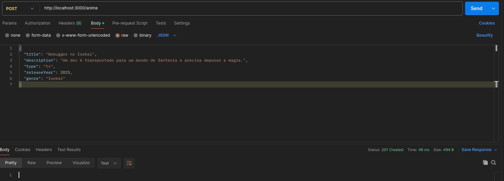
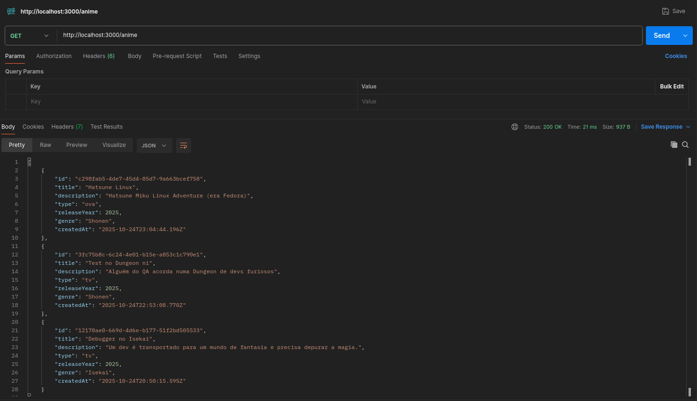
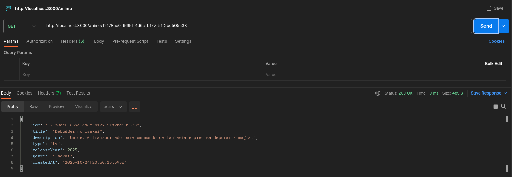
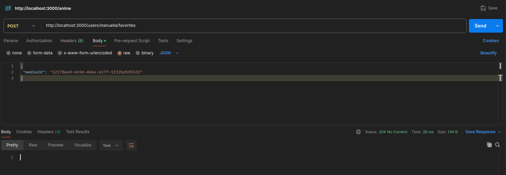
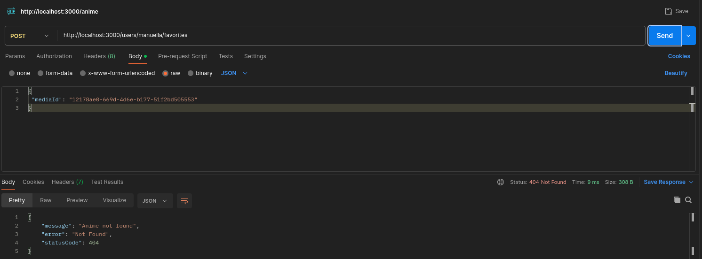
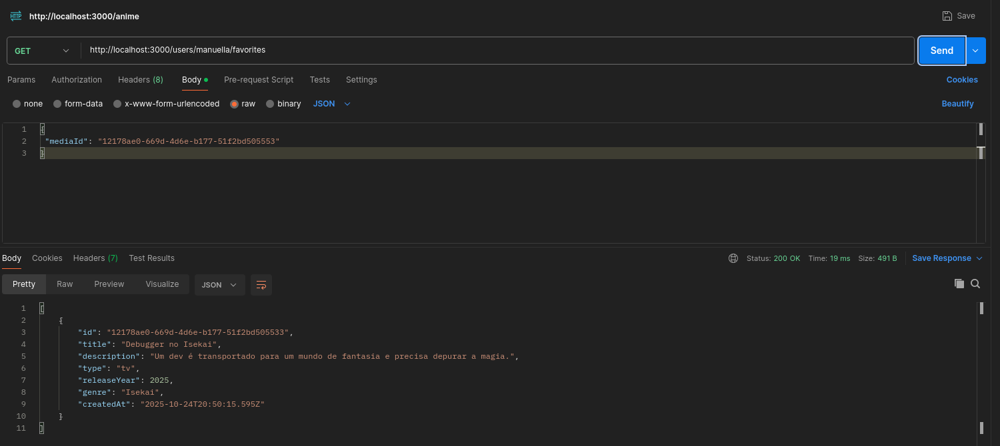
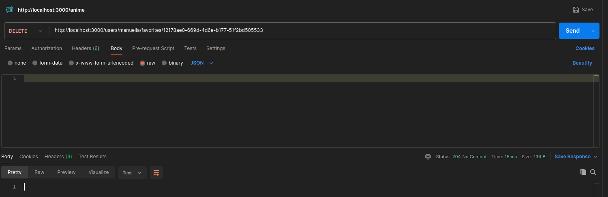

# 🎬 OtakuPlay - API de Catálogo de Animes e Favoritos

A **OtakuPlay** é uma API RESTful desenvolvida em **NestJS** para gerenciar um catálogo de animes e as listas de favoritos dos usuários.

Este projeto foi criado como parte de um teste técnico para vaga de **Desenvolvedor(a) Back-End**.

---

## 🚀 Tecnologias Utilizadas

- **Node.js** + **TypeScript**
- **NestJS** -> Framework principal
- **TypeORM** -> ORM para interação com o banco de dados
- **PostgreSQL & DBeaver** -> Banco de dados e ferramenta de gerenciamento
- **Jest** -> Framework de testes
- **Docker & Docker Compose** -> Containerização da aplicação
- **Husky, ESLint & Prettier** -> Ferramentas para consistência do código

As tecnologias e frameworks escolhidos foram selecionados principalmente com base na minha familiaridade com cada um, dentre as opções disponíveis. Além disso, considerei quais se adequavam melhor à complexidade do projeto.

---

## 🛠️ Rodando o Projeto

### Configuração e acesso com o Docker

1.  **Clone o repositório**
    ```bash
    git clone https://github.com/DBPerlin/otaku-play.git
    cd otaku-play
    ```
2.  **Construa as imagens Docker**

    Este comando irá construir as imagens Docker definidas no `docker-compose.yml`. A flag `--no-cache` garante que as imagens sejam construídas do zero, sem utilizar o cache de builds anteriores, o que pode ser útil para evitar problemas com dependências desatualizadas.

    ```bash
    docker compose build --no-cache
    ```

3.  **Execute os containeres Docker**

    Este comando irá iniciar todos os serviços definidos no `docker-compose.yml` em modo "attached", mostrando os logs no terminal.

    ```bash
    docker compose up
    ```

    Para rodar em modo "detached" (em segundo plano), adicione a flag `-d`:

    ```bash
    docker compose up -d
    ```

4.  **Acesse a aplicação**
    A aplicação estará acessível em:
    - `http://localhost:8080`

---

## 🧩 Rodando os Testes

Para rodar os testes, utilizei o **Jest**. Existem dois arquivos nos seguintes caminhos **"src/anime/anime.service.spec.ts"**, onde estão configurados os testes do **anime.service.ts** e **"src/favorites/favorites.service.spec.ts"**, onde estão configurados os testes do **favorites.service.ts**.

### **Para rodar os testes**

```
npm run test
```

### Para ver a cobertura dos testes

```
npm run test -- --coverage
```

- **Um relatório detalhado será gerado na pasta: _coverage/lcov-report/index.html_**

---

## 📖 Documentação dos Endpoints da API

A URL base para todos os endpoints é: http://localhost:3000.

### **Adiciona um novo título de anime ao catálogo (POST)**

**Endpoint:** /anime

**Resposta de sucesso (201 Created)**

**Body:**

```
{
  "title": "Titulo do anime",
  "description": "Descrição do anime",
  "type": "tv",
  "releaseYear": <ano-de-lançamento>,
  "genre": "gênero"
}
```

**Print do Postman:**



---

### **Lista todos os animes disponíveis no catálogo (GET)**

**Endpoint:** /anime

**Resposta de sucesso (200 OK)**

**Print do Postman:**



---

### **Busca um anime específico pelo seu id (GET)**

**Endpoint:** /anime/{id}

**Resposta de sucesso (200 OK)**

**Print do Postman:**



---

### **Adiciona um anime à lista de favoritos de um usuário (POST)**

**Endpoint:** /users/{userId}/favorites

**Resposta de sucesso (204 No Content)**
**Resposta de erro (404 Not Found)**

**Body:**

```
{
 "mediaId": "uuid-do-anime"
}
```

**Print do Postman:**



---



---

### **Lista todos os itens da lista de favoritos de um usuário (GET)**

**Endpoint:** /users/{userId}/favorites

**Resposta de sucesso (200 OK)**

**Print do Postman:**



---

### **Remove um anime da lista de favoritos de um usuário (DELETE)**

**Endpoint:** /users/{userId}/favorites/{mediaId}

**Resposta de sucesso (204 No Content)**

**Print do Postman:**



---

_Feito por: Manuella Perlin_
